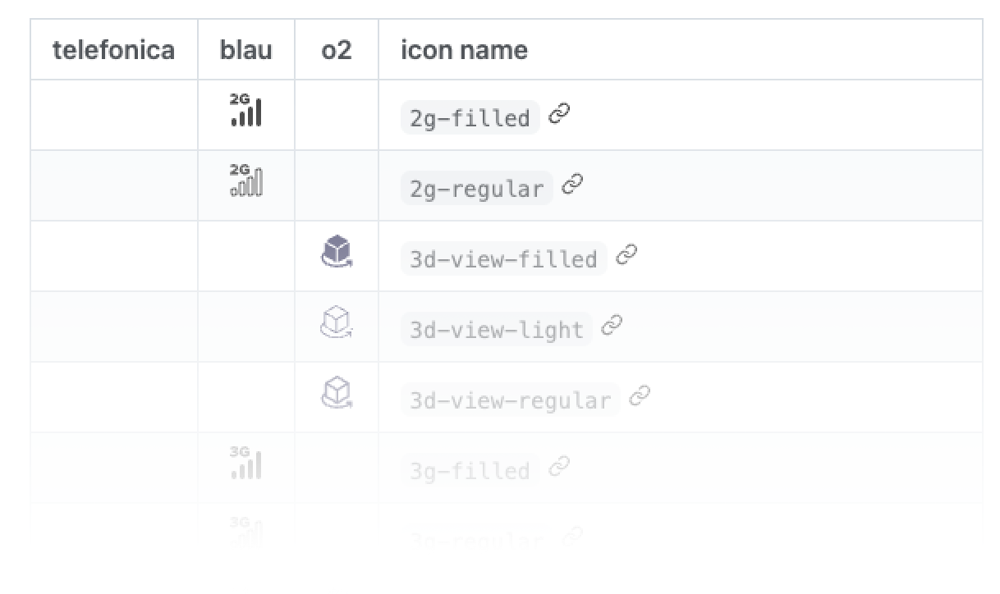

## What is this?

This is the repo that contains all icons that is working in [Mistica Design](https://github.com/Telefonica/mistica-design) now.

Mistica support [Brand Factory icons](https://brandfactory.telefonica.com/document/1086#/nuestra-identidad/iconos). This set of icons are a big list of different icons and style that Brand Team worked to be used through Telefonica applications.

If you have any question, please you can ask directly in the app of Microsoft Teams, in [Mistica Team](https://teams.microsoft.com/l/team/19%3ad2e3607a32ec411b8bf492f43cd0fe0c%40thread.tacv2/conversations?groupId=e265fe99-929f-45d1-8154-699649674a40&tenantId=9744600e-3e04-492e-baa1-25ec245c6f10).

## Documentation

### Develop

#### iOS and Android

You can get .pdf or .svg files from this repo.

#### Web

Visit [Mistica Storybook](https://mistica-web.vercel.app/?path=/story/icons-catalog--catalog) to get all the detail about using Mistica Icons Library

### Design

Use Mística icons library in Figma!

_Click the image below to see full list of equivalence icon list_

