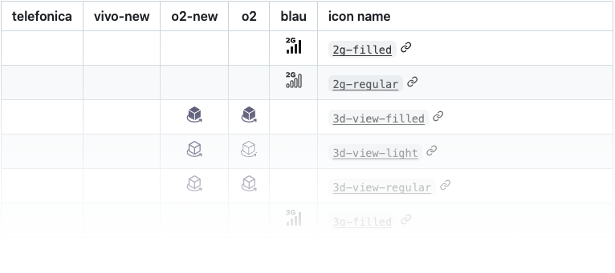

Mística Icons is a multibrand icon system that contains all icons that is working in [Mistica Design System](https://github.com/Telefonica/mistica) now.  

Mistica support [Brand Factory icons](https://brandfactory.telefonica.com/document/1086#/nuestra-identidad/iconos). This set of icons are a big list of different icons and style that Brand Team worked to be used through Telefonica applications.

If you have any question, please you can ask directly in the app of Microsoft Teams, in [Mistica Team](https://teams.microsoft.com/l/team/19%3ad2e3607a32ec411b8bf492f43cd0fe0c%40thread.tacv2/conversations?groupId=e265fe99-929f-45d1-8154-699649674a40&tenantId=9744600e-3e04-492e-baa1-25ec245c6f10).  

## Documentation

### Develop

#### iOS and Android

You can get .pdf or .svg files from this repo.

#### Web

Visit [Mistica Storybook](https://mistica-web.vercel.app/?path=/story/icons-catalog--catalog) to get all the detail about using Mistica Icons Library

### Design

Use Mística icons library in Figma!

## Equivalence status

Telefonica  

Vivo-New  

O2  

Blau  

  
| ICON SET | CONCEPTS (745) | TOTAL (2192) | ALL EQUIVALENCE | SOME EQUIVALENCE | UNIQUE | MISSING |
| :--------- | --------: | -----: | ----------: | -------------------: | -------------------: | ------------: |
| Telefonica | 719 | 2069 | 65 (3.0%)  | 1602 (73.1%)  | 402 (18.3%)  | 123 (5.6%)  |
| Vivo-New | 470 | 1312 | 65 (3.0%)  | 1204 (54.9%)  | 43 (2.0%)  | 880 (40.1%)  |
| O2 | 320 | 947 | 65 (3.0%)  | 817 (37.3%)  | 65 (3.0%)  | 1245 (56.8%)  |
| Blau | 64 | 81 | 65 (3.0%)  | 14 (0.6%)  | 2 (0.1%)  | 2111 (96.3%)  |

**Concepts**: Counts the different names of icons in the set excluding any variations in style or weight.  
**Total**: The total number of icons found in a brand set. Counting light, regular and filled weights.  
**All Equivalence**: Icons that are present in all sets.  
**Some Equivalence**: Icons that are present in some sets.  
**Unique**: Icons that only exists in this set.  
**Missing**: Missing icons with respect to other sets.

## Icon table equivalence

This table shows the equivalence of icons between the different brands.

[View icon table →](ICON_TABLE.md)

